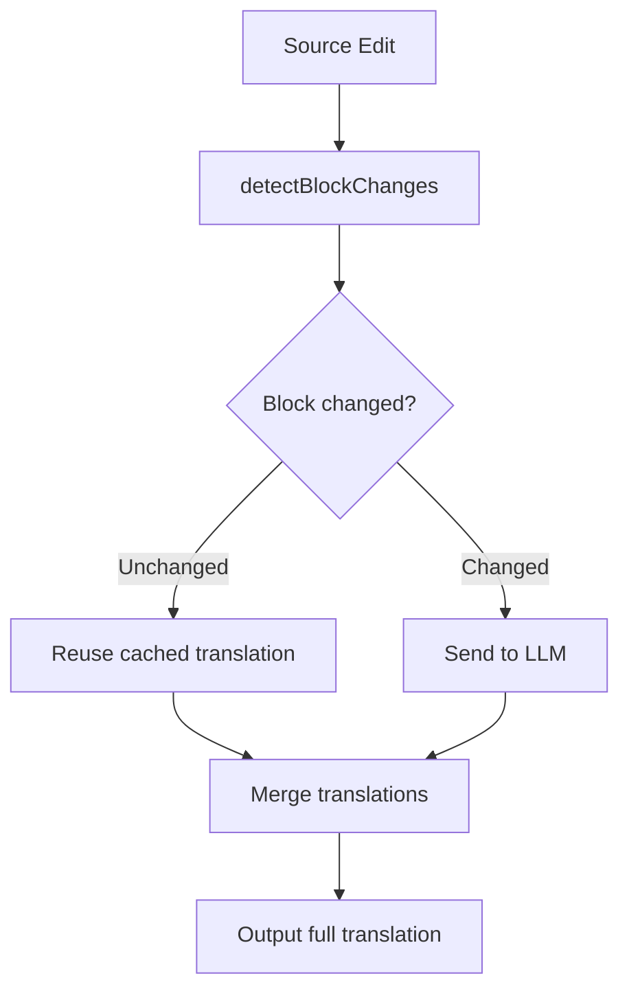

# Markdown AI Translator - Development Guidelines

## Project Structure

```
markdown-ai-translator/
├── src/
│   ├── extension.ts      # VSCode extension entry point
│   ├── translator.ts     # Translation logic using LanguageModel API
│   ├── preview.ts        # Webview panel management
│   ├── session.ts        # Translation session with conversation history
│   ├── cache.ts          # Translation cache
│   └── webview/          # React webview (separate package)
│       ├── src/
│       ├── biome.json    # Biome configuration
│       └── package.json
├── package.json          # Extension manifest
└── tsconfig.json
```

## Build Process

### Before Building

**Always run Biome checks on the webview before building:**

```bash
# Navigate to webview directory
cd src/webview

# Format code
npm run format

# Lint and fix issues
npm run lint

# Run all checks (format + lint)
npm run check

# Return to root
cd ../..
```

### Building

```bash
# Build everything (webview + extension)
npm run build

# Or build separately
npm run build:webview
npm run build:extension
```

### Quick Command (from project root)

```bash
cd src/webview && npm run check && cd ../.. && npm run build
```

## Biome Commands (in src/webview)

| Command | Description |
|---------|-------------|
| `npm run format` | Format all files |
| `npm run lint` | Lint and auto-fix issues |
| `npm run check` | Run both format and lint with auto-fix |
| `npm run biome:ci` | CI mode (no auto-fix, fails on errors) |

## Development Workflow

1. Make changes to code
2. Run `npm run check` in `src/webview` to format and lint
3. Run `npm run build` from project root to compile
4. Press F5 in VSCode to launch Extension Development Host
5. Open a Markdown file and use `Cmd+Shift+T` to translate

## Key Features

- **Streaming Translation**: Shows translation output as it streams from LLM
- **Incremental Translation**: Uses conversation history to only translate changed parts
- **Document Change Detection**: Monitors source file and shows indicator when changes detected
- **Model Selection**: Switch between available language models

## Architecture

### Translation Cache (`src/cache.ts`)

```
TranslationCache (Singleton, In-memory)
├── cache: Map<contentHash, translation>        ← Legacy (full document)
└── blockCache: Map<sourceHash, Map<targetLanguage, translation>>  ← Block-based
```

| Property | Current State |
|----------|---------------|
| Scope | Global (not per-file) |
| Persistence | None (in-memory only) |
| TTL | 24 hours |
| Key | SHA-256 hash of block content + language |

- Same content shares cache across different files
- Cache is lost on VSCode restart

### Incremental Translation (`src/parser.ts`, `src/session.ts`)

**Block Parsing:**

Markdown documents are parsed into discrete blocks:
- `heading`, `paragraph`, `list`, `code_block`, `blockquote`, `table`, `front_matter`, `html_block`, `thematic_break`, `blank_lines`

Each block has:
- `content`: Raw markdown text
- `hash`: SHA-256 hash of content
- `index`: Position in document
- `startLine` / `endLine`: Line numbers

**Change Detection (`detectBlockChanges`):**

1. **Phase 1 - Hash Matching**: Find blocks with identical content (unchanged)
2. **Phase 2 - Position Matching**: Match unmatched blocks by type and position (within 3 positions)
3. **Remaining**: Unmatched old blocks → removed, unmatched new blocks → added

**Change Count:**
- `blank_lines` blocks are excluded from the count (they don't need re-translation)
- Only content blocks are counted in "X blocks changed" indicator

**Diff Update Flow:**



### Chunk Size and Block Relationship

Chunk size controls how many characters are sent to the LLM per translation request.
Blocks are grouped into chunks respecting block boundaries.

```
Document (Total: 11,000 chars)          Chunk Size: 5,000 chars
┌─────────────────────────────┐
│ Block 0 (1,000 chars)       │─┐
│ Block 1 (2,000 chars)       │ │ Chunk 1 (4,500 chars)
│ Block 2 (1,500 chars)       │─┘ → First translation
├─────────────────────────────┤
│ Block 3 (2,000 chars)       │─┐
│ Block 4 (1,500 chars)       │ │ Chunk 2 (5,000 chars)
│ Block 5 (1,500 chars)       │─┘ → "Continue" button
├─────────────────────────────┤
│ Block 6 (1,500 chars)       │─── Chunk 3 (1,500 chars)
└─────────────────────────────┘     → "Continue" button
```

**Key Points:**
- Blocks are never split mid-content (respects block boundaries)
- Chunks accumulate blocks until adding the next block would exceed the limit
- `translatedUpToBlockIndex` tracks progress for partial translations
- "Continue" translates the next chunk; "Translate All" processes remaining chunks
